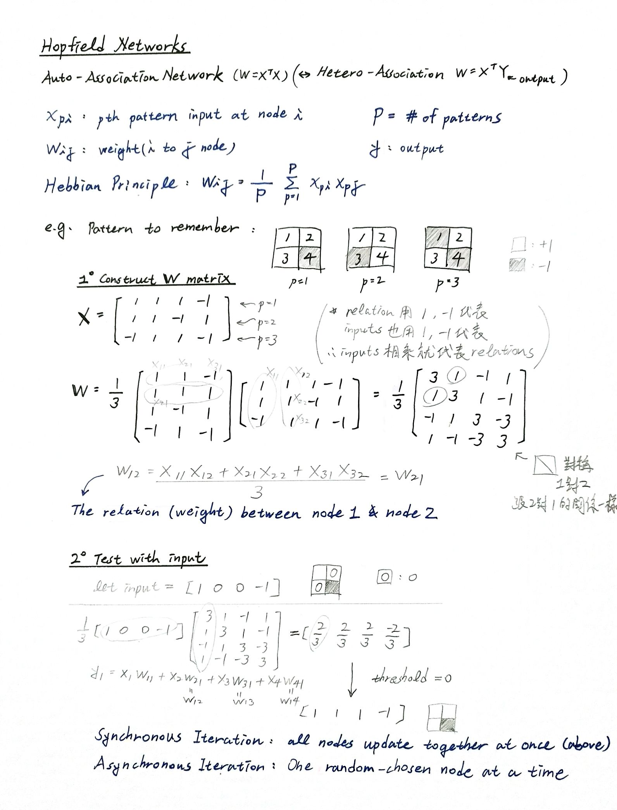
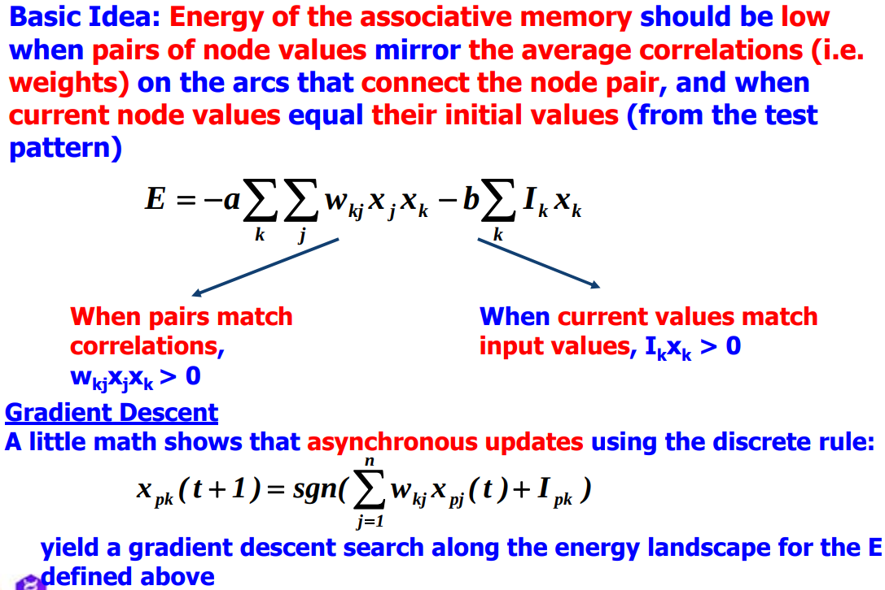

# Hopfield_Networks

Hopefield Networks: A Hopfield network is a form of recurrent artificial neural network popularized by John Hopfield in 1982, but described earlier by Little in 1974. Hopfield nets serve as **content-addressable ("associative") memory systems** with binary threshold nodes. They are guaranteed to converge to a **local minimum**, but will sometimes converge to a false pattern (wrong local minimum, spurious) rather than the stored pattern (expected local minimum). Hopfield networks also provide a model for understanding human memory.

* Synchronous updates can easily lead to oscillation

* Asynchronous updates can quickly find a local optima (attractor). Update order can determine attractor that is reached.

* Capacity = # of patterns / # of nodes or # of patterns / # of weights

* A detailed proof shows that a Hopfield network of N nodes can achieve 100% correct retrieval on P patterns if: P < N/(4*ln(N))

* Energy: Hopfield nets have a scalar value associated with each state of the network, referred to as the "energy", E, of the network.

